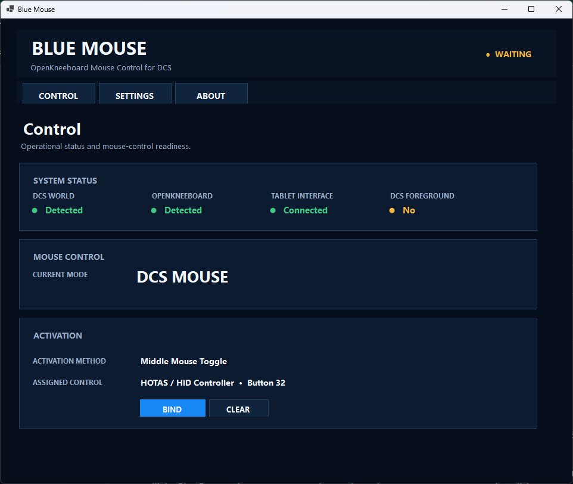
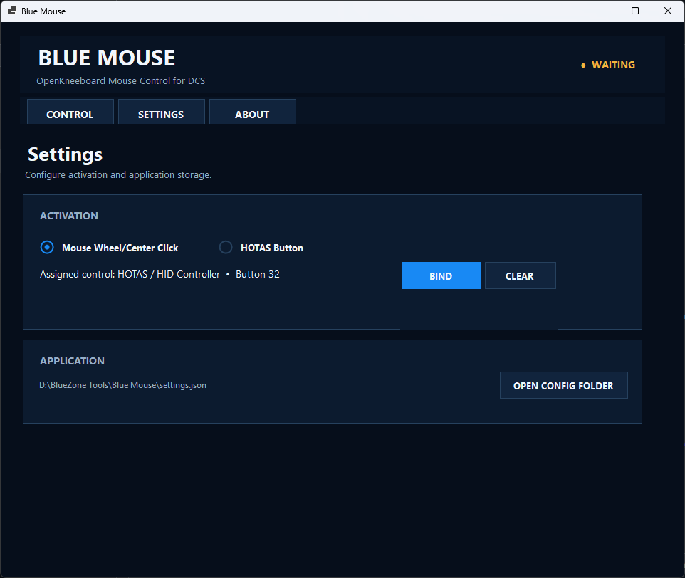

# 🖱️ Blue Mouse

> Turn your normal mouse into an OpenKneeboard controller while flying DCS World in VR.

**Blue Mouse** is a lightweight Windows utility designed for DCS World pilots who use **OpenKneeboard in VR**.

It allows your normal desktop mouse to temporarily control OpenKneeboard without taking focus away from DCS.

Activate Blue Mouse with a mouse-wheel click or an assigned HOTAS button, use your mouse to interact with OpenKneeboard, then deactivate it to immediately return normal mouse control to DCS.

---

## ✨ Features

### 🖱️ Mouse Control for OpenKneeboard

Blue Mouse converts normal mouse movement into tablet-style input that OpenKneeboard can use.

While Blue Mouse is active:

- Move the mouse to move the OpenKneeboard pointer
- Left-click to select tabs, buttons, and other OpenKneeboard controls
- DCS remains the foreground application
- Mouse movement and clicks are prevented from accidentally operating the DCS cockpit

Deactivate Blue Mouse and your mouse immediately returns to normal DCS operation.

---

## 🎮 HOTAS Activation

Blue Mouse can be activated directly from a joystick, throttle, or other compatible HOTAS device.

No VoiceAttack keyboard mapping is required.

Use **Bind** in Blue Mouse and press the HOTAS button you want to assign.

Your assignment is saved automatically and restored the next time Blue Mouse starts.

This makes it possible to:

1. Keep your headset on
2. Press your assigned HOTAS control
3. Use your normal mouse with OpenKneeboard
4. Press the HOTAS control again
5. Immediately return the mouse to DCS

---

## 🖱️ Middle Mouse Activation

Don't want to dedicate a HOTAS button?

Blue Mouse can also use the standard **mouse wheel / middle-click button** as the activation control.

Click once to enable OpenKneeboard mouse control.

Click again to return to normal DCS mouse control.

The middle-click activation is intercepted only when Blue Mouse can safely route input to OpenKneeboard.

---

## 🥽 Designed for DCS VR

Blue Mouse was created specifically to solve a problem encountered when using **DCS World and OpenKneeboard in VR**.

Normally, interacting with an overlay while another application owns the foreground can be difficult.

Blue Mouse avoids switching application focus.

**DCS remains the foreground application while the mouse controls OpenKneeboard.**

This means no Alt-Tab, no bringing OpenKneeboard to the foreground, and no intentional interruption of DCS focus.

---

## 🛡️ Mouse Isolation

When Blue Mouse is active and OpenKneeboard is available, Blue Mouse prevents the same physical mouse input from accidentally interacting with the DCS cockpit.

This includes:

- Mouse movement
- Left mouse clicks

When Blue Mouse is deactivated, normal DCS mouse operation is restored immediately.

---

## 🚨 Emergency Release

Blue Mouse includes an emergency release mechanism.

Press:

**ESC**

to immediately release Blue Mouse control and restore normal mouse operation.

Safety mechanisms are also built into the application to release mouse control if the OpenKneeboard connection is lost.

---

## 🔌 OpenKneeboard Integration

Blue Mouse communicates with OpenKneeboard using its tablet-input interface.

The application currently supports the OTD-IPC interface used by OpenKneeboard, including compatibility with the legacy interface used by OpenKneeboard 1.12.x.

Blue Mouse creates a virtual tablet input source that OpenKneeboard can recognize while DCS remains the active foreground application.

No modification to DCS is required.

Blue Mouse does **not** modify:

- DCS program files
- DCS Saved Games files
- `Export.lua`
- DCS input configuration
- DCS rendering
- DCS missions

---

## 🖼️ Screenshots

Add screenshots here:

### Blue Mouse

### Settings

---

## 📦 Installation

### Recommended Installation

1. Open the **Releases** section of this repository.
2. Download the latest:

   `BlueMouse-x.x.x-Setup.exe`

3. Run the installer.
4. Review and accept the EULA.
5. Follow the installation prompts.
6. Launch Blue Mouse.

The installer creates the appropriate BlueZone Tools installation structure and can create Start Menu and optional Desktop shortcuts.

---

## 🗂️ Installation Location

Blue Mouse is designed to install as part of the **BlueZone Tools** collection.

Typical installation:

`C:\BlueZone Tools\Blue Mouse`

If an existing BlueZone Tools directory is found on another supported drive, the installer may use that location.

A custom installation location can also be selected during setup.

---

## 🚀 First Run

After installing Blue Mouse:

1. Start **Blue Mouse**.
2. Start **OpenKneeboard**.
3. Start **DCS World**.
4. Open the Blue Mouse **Settings** page.
5. Select your preferred activation method.

Choose either:

### Mouse Wheel / Middle Click

No configuration is required.

or:

### HOTAS Button

1. Select the HOTAS activation option.
2. Click **Bind**.
3. Press the desired joystick or throttle button.
4. Confirm that Blue Mouse displays the assigned control.

The assignment is saved automatically.

---

## ✈️ Using Blue Mouse

Once DCS and OpenKneeboard are running:

### Normal Operation

Your mouse controls DCS normally.

### Activate Blue Mouse

Press your assigned HOTAS button or middle-click the mouse.

Blue Mouse switches to:

**KNEEBOARD MOUSE**

Move the mouse and the OpenKneeboard pointer will respond.

Use the left mouse button to interact with OpenKneeboard.

### Return to DCS

Press your activation control again.

Blue Mouse returns to:

**DCS MOUSE**

Your normal DCS mouse control is immediately restored.

---

## ⚙️ Configuration

Blue Mouse remembers configuration automatically.

Saved settings include items such as:

- Activation method
- HOTAS device
- HOTAS button assignment
- Mouse/tablet calibration
- Sensitivity
- Window position

When possible, Blue Mouse stores its configuration with the application.

If the installation directory cannot be written safely, Blue Mouse can use the user's Local AppData directory instead.

The currently active configuration location can be viewed from within Blue Mouse.

---

## 🔧 Diagnostics

Blue Mouse contains an additional diagnostic interface intended primarily for troubleshooting and development.

Launch Blue Mouse with:

`--diagnostics`

to expose the **Diagnostics** page.

Diagnostic information includes:

- DCS detection
- OpenKneeboard detection
- Foreground process
- Tablet connection
- HOTAS/HID information
- Mouse input state
- Virtual tablet state
- Suppressed input events
- Configuration path
- Log information

For normal use, Diagnostics is intentionally hidden.

---

## 🖥️ System Requirements

- 🪟 Windows 10 or Windows 11
- ✈️ DCS World
- 🥽 OpenKneeboard
- 🖱️ Standard Windows mouse
- 🎮 Optional joystick/HOTAS device
- 🥽 VR headset for the intended use case

Blue Mouse is primarily designed and tested for **DCS World VR with OpenKneeboard**.

---

## 🛠️ Built With

Blue Mouse is developed using:

- C#
- .NET 10
- Windows Forms
- Windows Raw Input
- Windows HID APIs
- OpenKneeboard OTD-IPC tablet integration
- Windows low-level input hooks

Blue Mouse does not require a kernel-mode virtual tablet driver.

---

## 🐞 Bug Reports

Found a problem?

When reporting an issue, please include:

- Blue Mouse version
- Windows version
- DCS version
- OpenKneeboard version
- Activation method used
- HOTAS model, if applicable
- Description of the problem
- Steps required to reproduce it
- Screenshots or Blue Mouse logs when available

Please use the repository **Issues** section for bug reports.

---

## 💡 Feature Requests

Ideas and suggestions are welcome.

Blue Mouse was created to make interacting with OpenKneeboard in VR simpler and more natural while keeping DCS in control of the foreground.

Feature requests can be submitted through the repository **Issues** section.

---

## 📜 License

Blue Mouse is provided under the license/EULA included with the application.

Please review the license terms before installing, redistributing, or modifying the application.

---

## ⚠️ Disclaimer

Blue Mouse is an independent community-developed utility.

It is not affiliated with or endorsed by Eagle Dynamics or the OpenKneeboard project.

DCS World and associated names and trademarks are the property of their respective owners.

Use of this software is at your own risk.

---

## 💙 BlueZone

Blue Mouse is part of the **BlueZone Tools** collection.

BlueZone develops tools and utilities designed to improve the DCS World experience for pilots, mission creators, server administrators, and communities.

### BlueZone Tools

- 🚀 **Blue Runner** — DCS application launcher and utility manager
- 🖱️ **Blue Mouse** — OpenKneeboard mouse control for DCS VR
- 🧩 **Blue Mods** — DCS modification management
- 📊 **BlueReel** — DCS event logging and analysis
- 🎬 Additional BlueZone utilities and tools

---

## 🤝 Support the Project

Blue Mouse is developed and maintained as a free tool for the DCS community.

Development, testing, documentation, and continued improvements all take time and resources. If Blue Mouse improves your DCS VR experience and you would like to support continued BlueZone development, your contribution is greatly appreciated—but never expected.

### ☕ [Support on Ko-fi](https://ko-fi.com/bluezone116)

### 💙 [Support with PayPal](https://paypal.me/bluezone116)

### 🚀 [Join us on Patreon](https://www.patreon.com/bluezone116)

Every contribution helps support continued development, testing, community infrastructure, and future BlueZone tools.

Thank you for using Blue Mouse and supporting the BlueZone community. ✈️

---

## 🖱️ Mouse to Kneeboard. Back to Flying.

**Activate. Navigate. Click. Fly.**

🖱️ **Blue Mouse — OpenKneeboard control without leaving DCS.**
